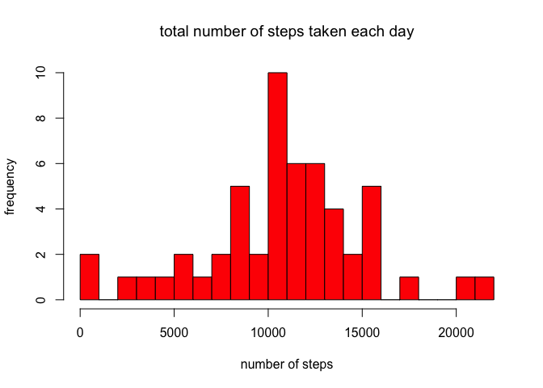
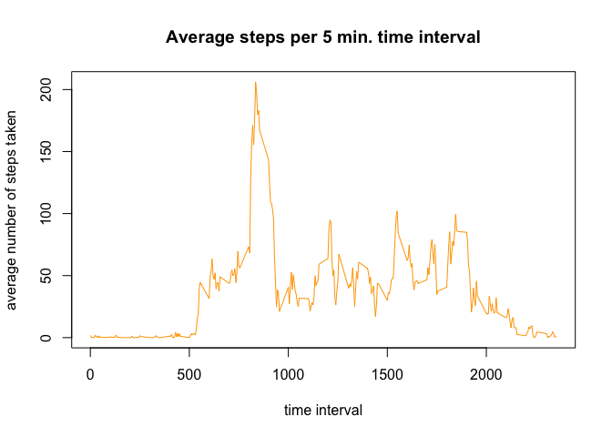
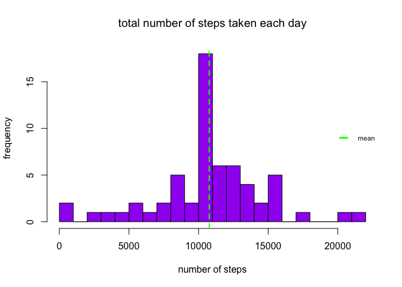
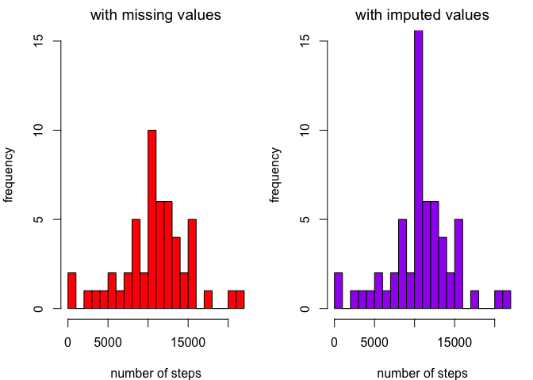
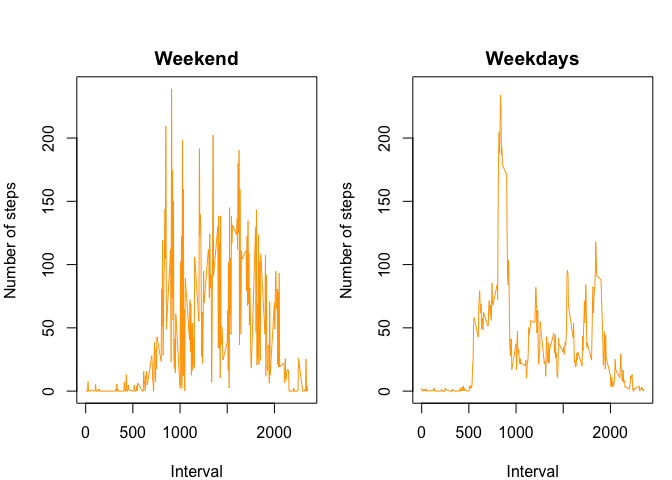

# Reproducible Research - Peer Assessment 1 - activity monitoring of personal movement
Lotte Sluyser
29 april 2017

## Reading the data
First the data is loaded into the dataset Monitor. 
Plyr and Dplyr are loaded for later processing of the data. 


```r
Monitor<- read.csv("activity.csv")
library(plyr)
library(dplyr)
```

## Summarizing the number of steps per day
First aggregate the data by sum of the steps and date.
Then change the class of the date column to be able to plot it nicely. 


```r
a<- aggregate(steps ~ date, Monitor, sum)
a$date <- as.Date(a$date)
```

## Make a histogram of total number of steps taken each day

```r
hist(a$steps,
        main=expression('total number of steps taken each day'),
        xlab='number of steps', ylab="frequency",col="red", breaks=20)
```

<!-- -->

## What is the mean of the number of steps taken per day?
This is shown with the summary function.

```r
summary(a$steps)
```

```
##    Min. 1st Qu.  Median    Mean 3rd Qu.    Max. 
##      41    8841   10760   10770   13290   21190
```

The summary shows that the median number of steps taken each day is 10760 and the mean is 10770.

The average number of steps (mean) can also be shown in the histogram:


```r
hist(a$steps,
        main=expression('total number of steps taken each day'),
        xlab='number of steps', ylab="frequency",col="red", breaks=20)
abline(v=mean(a$steps), col="green", lty=2, lwd=2)
legend("right", bty = "n", lty=2,lwd=1,col="green",legend="mean", cex=0.7, y.intersp=0.1)
```

<!-- -->

## What is the average daily activity pattern?

This is a time series plot of the average number of steps taken.

```r
b<- aggregate(steps ~ interval, Monitor, mean)
plot(b$interval, b$steps, type="l", col="orange",main="Average steps per 5 min. time interval", xlab="time interval", ylab="average number of steps taken") 
```

<!-- -->

## Which 5 minute interval contains the max number of steps on average?


```r
filter(b, steps==max(b$steps))
```

```
##   interval    steps
## 1      835 206.1698
```

The interval 835 has the maximum number of steps: 206.1698

## A strategy for imputing missing data. 

The steps contain many missing data. A strategy for imputing the missing data is to take the mean of the number of steps in the same interval on other days. 
A new dataset, Monitor2 is created and imputed with the missing data.


```r
Monitor2<- read.csv("activity.csv")
Monitor2$steps[is.na(Monitor2$steps)] <- ave(Monitor2$steps, Monitor2$interval, 
        FUN = function(x) 
        mean(x, na.rm = TRUE))[c(which(is.na(Monitor2$steps)))]
```
Looking at the sum of the steps per day of the data without missing values and calculating the mean.


```r
c<- aggregate(steps ~ date, Monitor2, sum)
c$date <- as.Date(c$date)
summary(c$steps)
```

```
##    Min. 1st Qu.  Median    Mean 3rd Qu.    Max. 
##      41    9819   10770   10770   12810   21190
```
The median and mean are both 10770.

We again show the number of steps by day in a histogram, with the mean. 


```r
hist(c$steps,main=expression("total number of steps taken each day"), xlab="number of steps", ylab="frequency",col="purple", breaks=20)
abline(v=mean(c$steps), col="green", lty=2, lwd=2)
legend("right", bty = "n", lty=2,lwd=3,
col="green",legend="mean", cex=0.7, y.intersp=0.1)
```

<!-- -->

And then a time series plot of the average number of steps taken in the dataset with imputed values:


```r
d<- aggregate(steps ~ interval, Monitor2, mean)
plot(d$interval, d$steps, type="l", col="orange",main="Average steps per 5 min. time interval", xlab="time interval", ylab="average number of steps taken") 
```

<!-- -->

Which 5 minute interval contains the max number of steps on average?


```r
filter(d, steps==max(d$steps))
```

```
##   interval    steps
## 1      835 206.1698
```

The interval is again 835 and the maximum number of steps the same as before: 206.1698. 

Now I am going to compare the total number of steps taken without imputed data and with imputed data


```r
par(mfrow=c(1,2), mar=c(4,4,2,1))
hist(a$steps, main=expression("with missing values"),
      xlab='number of steps',ylab="frequency",col="red", breaks=20, ylim=c(0,15))
hist(c$steps,
      main=expression('with imputed values'),
      xlab='number of steps', ylab="frequency",col="purple", breaks=20, ylim=c(0,15))
```

<!-- -->

The histograms show that imputing missing values results in a higher count for number of steps with the highest occurance.

## Are there differences in activity patterns between weekdays and weekends?

In orde to create a panel plot that compares the average number of steps taken per 5 minute interval across weekdays and weekend, a column is added with weekdays to the dataset with imputed values, making use of the weekdays function. 


```r
Monitor2<- read.csv("activity.csv")
Monitor2$date <- as.Date(Monitor2$date)
Monitor2ex<- mutate(Monitor2,day=weekdays(Monitor2$date))
```

Then the data is split in 2 datasets: 1 with weekdays and 1 with weekends. From this 2 new datasets are made with the mean number of steps: d_weekend and d_weekdays.


```r
Monitor2exweekend<- filter(Monitor2ex,day==c("zaterdag","zondag"))
Monitor2exweekdays<- Monitor2ex[!(Monitor2ex$day %in% Monitor2exweekend$day),]
d_weekend<- aggregate(steps ~ interval, Monitor2exweekend, mean)
d_weekdays<- aggregate(steps ~ interval, Monitor2exweekdays, mean)
```

These 2 datasets are plotted next to each other. 
ylim is set to avoid different scales.


```r
par(mfrow=c(1,2), mar=c(4,4,2,1), oma=c(0,0,2,0))
plot(d_weekend$interval, d_weekend$steps, type="l", col="orange",main="Weekend", xlab="Interval", ylab="Number of steps",cex=1, ylim=range(c(d_weekend$steps, d_weekdays$steps))) 
plot(d_weekdays$interval, d_weekdays$steps, type="l", col="orange",main="Weekdays", xlab="Interval", ylab="Number of steps", cex=1, ylim=range(c(d_weekend$steps, d_weekdays$steps)))
```

<!-- -->

The conclusion is that the activity level in the weekend is higher during the day. 
On weekdays there is more activity in the early hours, so from 500 minutes on (8 am) and there is a peak at around 800 minutes (1 pm). 
